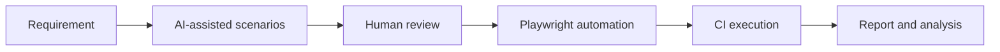

# Hi, I'm Devaki Bathalapalli 👋

### AI-Assisted Test Automation Engineer | Playwright | Selenium | Appium | API Testing

I am a Test Automation Engineer with experience testing **banking, insurance, healthcare, Salesforce, web, mobile, and API applications**. I build maintainable automation frameworks, integrate automated tests into CI/CD pipelines, and use AI responsibly to improve test design, coverage, debugging, and reporting.

## 👩‍💻 About Me

- 🔭 Currently working on Playwright-based UI, API, analytics, and end-to-end automation
- 🤖 Using AI to accelerate test-case design, edge-case discovery, code review, failure analysis, and documentation
- 🏦 Experienced in banking and financial applications, including American Express and ICICI
- 🛡️ Experienced in insurance and healthcare applications, including PFA, AccentCare, and Catalent
- ☁️ Familiar with AWS, Docker, GitHub Actions, Jenkins, and cloud-based test execution
- 📱 Experienced in Android and iOS automation using Appium
- 🎓 Master of Science in Information Systems from Saint Louis University
- 🌱 Continuously learning agentic testing, AI-driven QA, Playwright, and modern automation architecture

## 🛠️ Technical Skills

### Test Automation

`Playwright` `Selenium WebDriver` `Appium` `TestNG` `Cucumber BDD` `Screenplay Pattern` `Page Object Model` `Data-Driven Testing`

### API, Performance & Data Testing

`Playwright API` `Postman` `REST Assured` `REST APIs` `SOAP APIs` `OAuth 2.0` `JWT` `JMeter` `Tosca DI` `SQL`

### Languages & Development

`Java` `TypeScript` `JavaScript` `Python` `HTML` `CSS` `React` `Node.js` `SQL`

### Cloud, DevOps & CI/CD

`AWS` `Docker` `GitHub Actions` `Jenkins` `Azure DevOps` `Git` `GitHub` `GitLab`

### Salesforce

`Sales Cloud` `Service Cloud` `Health Cloud` `Experience Cloud` `Apex` `LWC` `SOQL` `CRM Analytics`

## 🚀 Featured Project

### [Playwright E2E & Telemetry Automation](https://github.com/DevakiTechData/Amex-E3-E2E)

A Playwright and TypeScript framework for validating modern web journeys and supporting services.

- End-to-end coverage for landing, home, authentication, and search journeys
- UI and API validation using Playwright
- Network-request and response-time verification
- Typeahead/search-result testing
- UI analytics and telemetry-event validation
- Feature-rollout validation across controlled user buckets
- Cross-browser and parallel execution
- Failure evidence using screenshots, traces, and videos
- Continuous execution using GitHub Actions

> The public project uses sanitized examples and contains no confidential customer data, credentials, internal URLs, or proprietary business logic.

## 🤖 How I Use AI in Testing

- Convert requirements and acceptance criteria into initial test scenarios
- Identify boundary, negative, accessibility, and integration cases
- Generate starter automation code that I review and refine
- Analyze Playwright traces, logs, screenshots, and CI failures
- Improve reusable tasks, selectors, test data, and documentation
- Keep final validation and release decisions under human review

## 💼 Domain Experience

| Domain | Selected Experience | Testing Focus |
|---|---|---|
| Banking & Financial Services | American Express, ICICI | Web, API, analytics, regression, end-to-end testing |
| Insurance | PFA | Business workflows, integration, functional and automation testing |
| Healthcare | AccentCare, Catalent | Salesforce, healthcare workflows, API, compliance-focused testing |
| Mobile | Enterprise mobile applications | Android/iOS automation, gestures, device and cross-platform validation |
| Salesforce | Sales, Service and Health Cloud | UI, workflow, integration, data and regression testing |

## 🏆 Certifications & Recognition

- Salesforce Platform Developer I
- Salesforce Administrator
- AWS Solutions Architect – Associate
- ISTQB certifications
- Best Employee – QualiZeal
- Woman of Capgemini – India

## 📊 GitHub Activity

## 📫 Connect With Me

- LinkedIn: Add your LinkedIn profile URL here
- GitHub: [github.com/DevakiTechData](https://github.com/DevakiTechData)

---

⭐ I am interested in opportunities involving **SDET, QA Automation, Playwright, AI-assisted testing, mobile automation, API testing, Salesforce QA, and quality engineering**.
